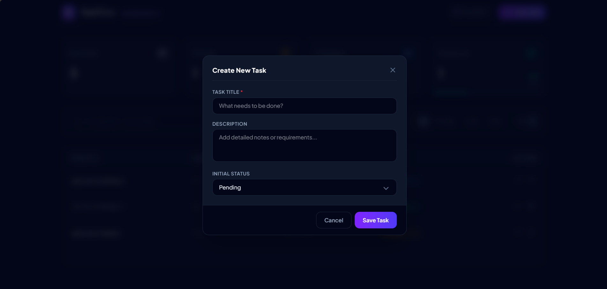

# TaskFlow — Premium Task Management Dashboard



TaskFlow is a premium, interactive single-page application (SPA) built for managing daily tasks. Designed with modern UX/UI principles, it features dynamic views, real-time filters, statistics tracking, and asynchronous database updates for a smooth, app-like user experience.

Developed as a technical assessment for **Lunivo Labs**.

---

## 🚀 Key Features

- **Dynamic SPA CRUD (No Page Reloads)**: All tasks are created, read, updated, and deleted asynchronously via AJAX requests powered by Alpine.js and Laravel controller endpoints.
- **Modern Kanban & List Views**:
  - **Kanban Board**: Multi-column board (Pending, In Progress, Completed) featuring quick transition buttons to advance or regress task statuses.
  - **Detailed List View**: A table-based view highlighting task descriptions, dates, and quick status dropdowns.
- **Dashboard Stats Panel**: A real-time metrics dashboard indicating total tasks, pending, active, completed, and an interactive overall completion progress bar.
- **Search & Sort Filters**:
  - Instant text filtering across task titles and descriptions.
  - Quick tab switching to isolate tasks by status (All, Pending, In Progress, Completed).
  - Sorting options (Newest First, Oldest First, Alphabetical A-Z).
- **Graceful Error Handling & Toasts**: Instantly alerts the user of success/error events with self-fading toast notifications.
- **Responsive Layout**: Designed to look stunning on mobile, tablet, and desktop monitors.

---

## 🛠️ Technology Stack

- **Backend**: [Laravel v12+](https://laravel.com)
- **Frontend Interactivity**: [Alpine.js](https://alpinejs.dev)
- **Styling**: [Tailwind CSS v4.0](https://tailwindcss.com) (Vite-integrated)
- **Database**: MySQL
- **Asset Bundle**: Vite
- **Testing**: PHPUnit

---

## ⚙️ Local Installation & Setup

Follow these steps to run the application locally on your machine:

### 1. Clone the Repository
```bash
git clone <repository-url>
cd task-dashboard
```

### 2. Install Dependencies
Install PHP and Node.js dependencies:
```bash
composer install
npm install
```

### 3. Environment Configuration
Copy the `.env.example` file to create your local `.env` configuration file:
```bash
copy .env.example .env
```
Open the `.env` file and set up your local MySQL database credentials:
```env
DB_CONNECTION=mysql
DB_HOST=127.0.0.1
DB_PORT=3306
DB_DATABASE=lunivo_tasks
DB_USERNAME=root
DB_PASSWORD=your_mysql_password
```

*(Make sure you have created the database `lunivo_tasks` in your MySQL database server before proceeding)*

### 4. Generate Application Key
Generate the Laravel security key:
```bash
php artisan key:generate
```

### 5. Run Database Migrations
Deploy the database schema:
```bash
php artisan migrate
```

### 6. Run Development Servers
You will need to run both the Laravel backend server and the Vite development server to watch and compile assets.

In terminal 1:
```bash
php artisan serve
```
The application will be accessible at: [http://127.0.0.1:8000](http://127.0.0.1:8000)

In terminal 2:
```bash
npm run dev
```

---

## 🧪 Running Automated Tests

We have written comprehensive Feature and Unit tests to assert that all backend endpoints, validation logic, and CRUD operations function correctly.

Run the test suite using:
```bash
php artisan test
```

Sample output:
```bash
   PASS  Tests\Unit\ExampleTest
  ✓ that true is true

   PASS  Tests\Feature\ExampleTest
  ✓ the application returns a successful response

   PASS  Tests\Feature\TaskTest
  ✓ it can display the tasks page
  ✓ it can create a task via ajax
  ✓ it can update task status via ajax
  ✓ it can update task details via ajax
  ✓ it can delete a task via ajax

  Tests:    7 passed (16 assertions)
  Duration: 3.83s
```
